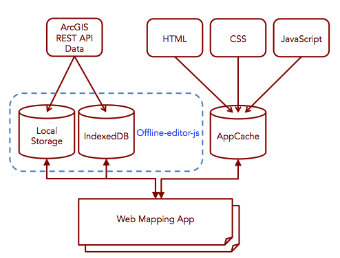

offline-editor-js
=================

Offline-editor-js is a set of JavaScript libraries for using the ArcGIS API for JavaScript offline. It offers both lightweight editing and tile management capabilities while offline or intermittently offline. It's a work-in-progress so if you have suggestions open an issue or if you want to make a pull request we welcome your proposed modifications. 

Online samples and getting started tutorials are available here: **[http://esri.github.io/offline-editor-js/demo/](http://esri.github.io/offline-editor-js/demo/)**

*IMPORTANT:* If you need a fully integrated robust offline solution then you should be using our ArcGIS Runtime SDKs for .NET, WPF, Java, iOS, Android and Qt.

This repo contains the following libraries:

- `/dist`: 
   * `offline-edit-min.js` - stores adds, updates and deletes of features as well as limited attachment support while offline. Resync's edits with server once connection is reestablished.
   * `offline-tiles-basic-min.js` - caches map tiles for partial offline use cases. Use this library with ArcGIS Online Web maps as well as with tiled map services. This repo will not work with browser restarts or reloads while offline. 
   * `offline-tiles-advanced-min.js` - Extends any ArcGIS Tiled Map Service that has a requirement for offline browser reload and/or restart. This library should be used in conjunction with an HTML5 application cache coding pattern.
   * `offline-tpk-min.js` - parses a TPK file and displays it as a tiled map layer.
- `/utils`: contains various helper library modules. These modules are all AMD compliant.
- `/samples`: samples that show how to use the different offline libraries capabilities.

#Workflows Supported
The following workflow is currently supported for both both features and tiles:

1) Load web application while online.
 
2) Once all tiles and features are loaded then programmatically take application offline. 

3) Make edits while offline.

4) Return online when you want to resync edits.

Using an [application manifest](https://developer.mozilla.org/en-US/docs/HTML/Using_the_application_cache) allows you to reload and restart the application while offline. The application manifest lets you store .html, .js, .css and image files locally.

__Attachment Support__: Attachments are supported with some limitations. See documentation [here](./doc/attachments.md)


#API and How To Use Docs

Go __[here](demo/api-doc.html)__ to get links to the API docs and How to use docs.

## Architecture



## Migrating from v1 to v2

If you are migrating your v1 code to v2 then go [here](doc/migratefromv1tov2.md) for some pointers.

##Setup Instructions

1. [Fork and clone the repo.](https://help.github.com/articles/fork-a-repo)
2. After cloning from github, `cd` into the `offline-editor-js` folder
3. Run `git submodule init` and `git submodule update`
4. Try out the apps in the `/samples` folder.

##Build Instructions

1. From the root directory run `npm install`
2. Run `Grunt build`. If there are no errors, the minimized _(min)_ and source _(src)_ versions of the libraries will be output to `\dist`

##Dependencies

* ArcGIS API for JavaScript (v3.8+)
* Node.js required for building the source
* NOTE: browser limitations and technical dependencies. The offline capabilities in this toolkit depend on certain HTML5 capabilities being present in the browser. Go [here](doc/dependencies.md) for a detailed breakdown of the information.
* We offer browser support for Chrome and Safari only, at this time. Some of the capabilities in the repository will not work on Internet Explorer. We continue to evaluate IE's capabilities as new releases become available to try and identify a point where we might be able to support it.  	

* Sub-modules (see `/vendor` directory)

   * [offline.js](https://github.com/hubspot/offline) - it allows detection of the online/offline condition and provides events to hook callbacks on when this condition changes
   * [IndexedDBShim](https://github.com/axemclion/IndexedDBShim) - polyfill to simulate indexedDB functionality in browsers/platforms where it is not supported (notably desktop Safari and iOS Safari)
   		- IMPORTANT: There are known [issues](https://github.com/axemclion/IndexedDBShim/issues/115) with IndexedDBShim on Safari. For Safari, the storage error workaround is to switch from using /dist/IndexedDBShim.min.js to just using IndexedDBShim.js and then search for and modify the line that defines the value for `DEFAULT_DB_SIZE`. Set this to more appropriate size that will meet all your storage needs, for example: ```var DEFAULT_DB_SIZE = 24 * 1024 * 1024```
   		- IMPORTANT: Coming in Safari 8 is built-in supported for IndexedDB. 
   * [jasmine.async](https://github.com/derickbailey/jasmine.async.git) - library to help implementing tests of async functionality (used in tests)

* Non sub-module based libraries
	* [FileSaver.js](https://github.com/Esri/offline-editor-js/blob/master/lib/tiles/README.md) - library to assist with uploading and downloading of files containing tile information.
	* [grunt-manifest](https://github.com/gunta/grunt-manifest) node.js library to assist with the creation of manifest files.
	* [zip](http://gildas-lormeau.github.io/zip.js/) A library for zipping and unzipping files. 
	* [xml2json](https://code.google.com/p/x2js/) A library for converting XML to JSON. Seems to handle complex XML. 

## Resources

* [ArcGIS Developers](http://developers.arcgis.com)
* [ArcGIS REST Services](http://resources.arcgis.com/en/help/arcgis-rest-api/)
* [twitter@esri](http://twitter.com/esri)

## Issues

Find a bug or want to request a new feature?  Please let us know by submitting an [issue](https://github.com/Esri/offline-editor-js/issues?state=open).

## Contributing

Anyone and everyone is welcome to contribute. Please see our [guidelines for contributing](https://github.com/esri/contributing).


## Licensing
Copyright 2014 Esri

Licensed under the Apache License, Version 2.0 (the "License");
you may not use this file except in compliance with the License.
You may obtain a copy of the License at

   http://www.apache.org/licenses/LICENSE-2.0

Unless required by applicable law or agreed to in writing, software
distributed under the License is distributed on an "AS IS" BASIS,
WITHOUT WARRANTIES OR CONDITIONS OF ANY KIND, either express or implied.
See the License for the specific language governing permissions and
limitations under the License.

A copy of the license is available in the repository's [license.txt]( license.txt) file.

[](Esri Tags: ArcGIS Web Mapping Editing FeatureServices Offline)
[](Esri Language: JavaScript)


